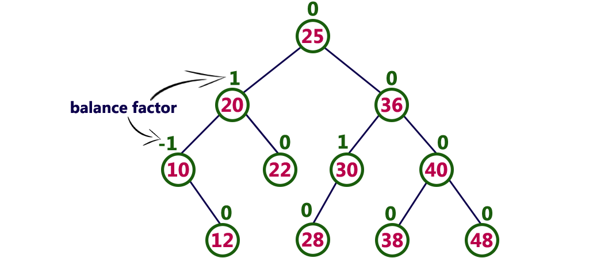
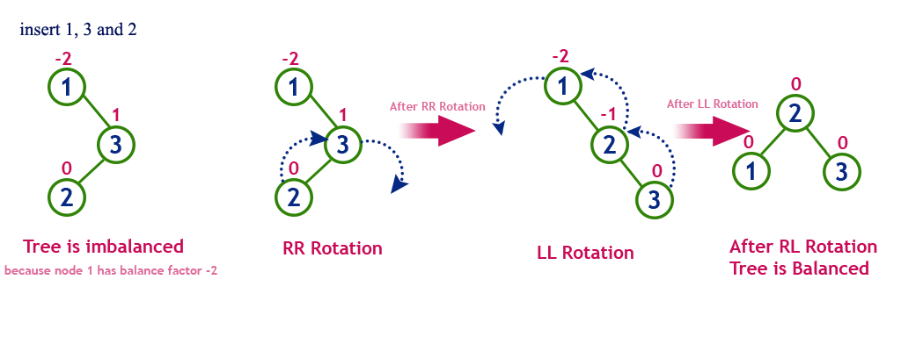

[二叉树](https://zh.wikipedia.org/wiki/%E4%BA%8C%E5%8F%89%E6%A0%91 "二叉树")

- [二叉查找树（BST）](https://zh.wikipedia.org/wiki/%E4%BA%8C%E5%85%83%E6%90%9C%E5%B0%8B%E6%A8%B9 "二叉搜索树")
- [笛卡尔树](https://zh.wikipedia.org/wiki/%E7%AC%9B%E5%8D%A1%E5%B0%94%E6%A0%91 "笛卡尔树")
- [MVP树](https://zh.wikipedia.org/w/index.php?title=MVP%E6%A0%91&action=edit&redlink=1 "MVP树（页面不存在）")
- [T树](https://zh.wikipedia.org/w/index.php?title=T%E6%A0%91&action=edit&redlink=1 "T树（页面不存在）")
- [线索二叉树](https://zh.wikipedia.org/wiki/%E7%BA%BF%E7%B4%A2%E4%BA%8C%E5%8F%89%E6%A0%91 "线索二叉树")

[自平衡二叉查找树](https://zh.wikipedia.org/wiki/%E8%87%AA%E5%B9%B3%E8%A1%A1%E4%BA%8C%E5%8F%89%E6%9F%A5%E6%89%BE%E6%A0%91 "自平衡二叉查找树")
- [AA树](https://zh.wikipedia.org/wiki/AA%E6%A0%91 "AA树")
- [AVL树](https://zh.wikipedia.org/wiki/AVL%E6%A0%91)
- [左倾红黑树](https://zh.wikipedia.org/wiki/%E5%B7%A6%E5%80%BE%E7%BA%A2%E9%BB%91%E6%A0%91 "左倾红黑树")
- [红黑树](https://zh.wikipedia.org/wiki/%E7%BA%A2%E9%BB%91%E6%A0%91 "红黑树")
- [替罪羊树](https://zh.wikipedia.org/wiki/%E6%9B%BF%E7%BD%AA%E7%BE%8A%E6%A0%91 "替罪羊树")
- [伸展树](https://zh.wikipedia.org/wiki/%E4%BC%B8%E5%B1%95%E6%A0%91 "伸展树")
- [树堆](https://zh.wikipedia.org/wiki/%E6%A0%91%E5%A0%86 "树堆")
- [加权平衡树](https://zh.wikipedia.org/wiki/%E5%8A%A0%E6%9D%83%E5%B9%B3%E8%A1%A1%E6%A0%91 "加权平衡树")

[B树](https://zh.wikipedia.org/wiki/B%E6%A0%91 "B树")
- [B+树](https://zh.wikipedia.org/wiki/B%2B%E6%A0%91 "B+树")
- [B\*树](https://zh.wikipedia.org/w/index.php?title=B*%E6%A0%91&action=edit&redlink=1 "B*树（页面不存在）")
- [Bx树](https://zh.wikipedia.org/w/index.php?title=Bx%E6%A0%91&action=edit&redlink=1 "Bx树（页面不存在）")
- [UB树](https://zh.wikipedia.org/w/index.php?title=UB%E6%A0%91&action=edit&redlink=1 "UB树（页面不存在）")
- [2-3树](https://zh.wikipedia.org/wiki/2-3%E6%A0%91 "2-3树")
- [2-3-4树](https://zh.wikipedia.org/wiki/2-3-4%E6%A0%91 "2-3-4树")
- [(a,b)-树](https://zh.wikipedia.org/w/index.php?title=(a,b)-%E6%A0%91&action=edit&redlink=1 "(a,b)-树（页面不存在）")
- [Dancing tree](https://zh.wikipedia.org/w/index.php?title=Dancing_tree&action=edit&redlink=1)
- [H树](https://zh.wikipedia.org/wiki/H%E6%A0%91 "H树")

[堆](https://zh.wikipedia.org/wiki/%E5%A0%86_(%E6%95%B0%E6%8D%AE%E7%BB%93%E6%9E%84) "堆 (数据结构)")
- [二叉堆](https://zh.wikipedia.org/wiki/%E4%BA%8C%E5%8F%89%E5%A0%86 "二叉堆")
- [二项堆](https://zh.wikipedia.org/wiki/%E4%BA%8C%E9%A1%B9%E5%A0%86 "二项堆")
- [斐波那契堆](https://zh.wikipedia.org/wiki/%E6%96%90%E6%B3%A2%E9%82%A3%E5%A5%91%E5%A0%86 "斐波那契堆")
- [左偏树](https://zh.wikipedia.org/wiki/%E5%B7%A6%E5%81%8F%E6%A0%91 "左偏树")
- [配对堆](https://zh.wikipedia.org/wiki/%E9%85%8D%E5%AF%B9%E5%A0%86 "配对堆")
- [斜堆](https://zh.wikipedia.org/wiki/%E6%96%9C%E5%A0%86 "斜堆")
- [Van Emde Boas tree](https://zh.wikipedia.org/w/index.php?title=Van_Emde_Boas_tree&action=edit&redlink=1)

[Trie](https://zh.wikipedia.org/wiki/Trie "Trie")
- [后缀树](https://zh.wikipedia.org/wiki/%E5%90%8E%E7%BC%80%E6%A0%91 "后缀树")
- [基数树](https://zh.wikipedia.org/wiki/%E5%9F%BA%E6%95%B0%E6%A0%91 "基数树")
- [三叉查找树](https://zh.wikipedia.org/wiki/%E4%B8%89%E5%8F%89%E6%90%9C%E7%B4%A2%E6%A0%91 "三叉搜索树")
- [X-快速前缀树](https://zh.wikipedia.org/w/index.php?title=X-%E5%BF%AB%E9%80%9F%E5%89%8D%E7%BC%80%E6%A0%91&action=edit&redlink=1 "X-快速前缀树（页面不存在）")
- [Y-快速前缀树](https://zh.wikipedia.org/w/index.php?title=Y-%E5%BF%AB%E9%80%9F%E5%89%8D%E7%BC%80%E6%A0%91&action=edit&redlink=1 "Y-快速前缀树（页面不存在）")
- [AC自动机](https://zh.wikipedia.org/wiki/AC%E8%87%AA%E5%8A%A8%E6%9C%BA%E7%AE%97%E6%B3%95 "AC自动机算法")

[二叉空间分割（BSP）](https://zh.wikipedia.org/wiki/%E4%BA%8C%E5%8F%89%E7%A9%BA%E9%97%B4%E5%88%86%E5%89%B2 "二叉空间分割")树
- [四叉树](https://zh.wikipedia.org/wiki/%E5%9B%9B%E5%8F%89%E6%A0%91 "四叉树")
- [八叉树](https://zh.wikipedia.org/wiki/%E5%85%AB%E5%8F%89%E6%A0%91 "八叉树")
- [_k_\-d树](https://zh.wikipedia.org/wiki/K-d%E6%A0%91 "K-d树")
- [隐式_k_\-d树](https://zh.wikipedia.org/w/index.php?title=%E9%9A%90%E5%BC%8Fk-d%E6%A0%91&action=edit&redlink=1 "隐式k-d树（页面不存在）")
- [VP树](https://zh.wikipedia.org/w/index.php?title=VP%E6%A0%91&action=edit&redlink=1 "VP树（页面不存在）")

非二叉树
- [指数树](https://zh.wikipedia.org/w/index.php?title=%E6%8C%87%E6%95%B0%E6%A0%91&action=edit&redlink=1)
- [融合树](https://zh.wikipedia.org/w/index.php?title=%E8%9E%8D%E5%90%88%E6%A0%91&action=edit&redlink=1)
- [PQ树](https://zh.wikipedia.org/w/index.php?title=PQ%E6%A0%91&action=edit&redlink=1)
- [SPQR树](https://zh.wikipedia.org/w/index.php?title=SPQR%E6%A0%91&action=edit&redlink=1)

[空间](https://zh.wikipedia.org/w/index.php?title=%E7%A9%BA%E9%97%B4%E6%95%B0%E6%8D%AE%E5%BA%93&action=edit&redlink=1 "空间数据库（页面不存在）")数据分割树
- [R树](https://zh.wikipedia.org/wiki/R%E6%A0%91 "R树")
- [R\*树](https://zh.wikipedia.org/wiki/R*%E6%A0%91 "R*树")
- [R+树](https://zh.wikipedia.org/wiki/R%2B%E6%A0%91 "R+树")
- [X树](https://zh.wikipedia.org/w/index.php?title=X%E6%A0%91&action=edit&redlink=1 "X树（页面不存在）")
- [M树](https://zh.wikipedia.org/w/index.php?title=M%E6%A0%91&action=edit&redlink=1 "M树（页面不存在）")
- [线段树](https://zh.wikipedia.org/wiki/%E7%B7%9A%E6%AE%B5%E6%A8%B9_(%E5%84%B2%E5%AD%98%E5%8D%80%E9%96%93) "线段树 (存储区间)")
- [可持久化线段树](https://zh.wikipedia.org/wiki/%E5%8F%AF%E6%8C%81%E4%B9%85%E5%8C%96%E7%BA%BF%E6%AE%B5%E6%A0%91 "可持久化线段树")
- [希尔伯特R树](https://zh.wikipedia.org/w/index.php?title=%E5%B8%8C%E5%B0%94%E4%BC%AF%E7%89%B9R%E6%A0%91&action=edit&redlink=1 "希尔伯特R树（页面不存在）")
- [优先R树](https://zh.wikipedia.org/w/index.php?title=%E4%BC%98%E5%85%88R%E6%A0%91&action=edit&redlink=1 "优先R树（页面不存在）")

其他树
- [散列日历](https://zh.wikipedia.org/w/index.php?title=%E6%95%A3%E5%88%97%E6%97%A5%E5%8E%86&action=edit&redlink=1 "散列日历（页面不存在）")
- [散列树](https://zh.wikipedia.org/w/index.php?title=%E6%95%A3%E5%88%97%E6%A0%91&action=edit&redlink=1 "散列树（页面不存在）")
- [Finger tree](https://zh.wikipedia.org/w/index.php?title=Finger_tree&action=edit&redlink=1)
- [顺序统计树](https://zh.wikipedia.org/wiki/%E9%A1%BA%E5%BA%8F%E7%BB%9F%E8%AE%A1%E6%A0%91 "顺序统计树")
- [Metric tree](https://zh.wikipedia.org/w/index.php?title=Metric_tree&action=edit&redlink=1)
- [Cover tree](https://zh.wikipedia.org/w/index.php?title=Cover_tree&action=edit&redlink=1)
- [BK树](https://zh.wikipedia.org/w/index.php?title=BK%E6%A0%91&action=edit&redlink=1 "BK树（页面不存在）")
- [Doubly chained tree](https://zh.wikipedia.org/w/index.php?title=Doubly_chained_tree&action=edit&redlink=1)
- [iDistance](https://zh.wikipedia.org/w/index.php?title=IDistance&action=edit&redlink=1)
- [Link-cut tree](https://zh.wikipedia.org/w/index.php?title=Link-cut_tree&action=edit&redlink=1)
- [Log-structured merge-tree](https://zh.wikipedia.org/w/index.php?title=Log-structured_merge-tree&action=edit&redlink=1)
- [树状数组](https://zh.wikipedia.org/wiki/%E6%A0%91%E7%8A%B6%E6%95%B0%E7%BB%84 "树状数组")
- [哈希树](https://zh.wikipedia.org/wiki/%E5%93%88%E5%B8%8C%E6%A0%91 "哈希树")

## 二分搜索树 Binary Search Tree（BST）

**二叉查找树定义**：又称为是二叉排序树（Binary Sort Tree）或二叉搜索树(Binary Search Tree)。二叉排序树或者是一棵空树，或者是具有下列性质的二叉树：

1) 若左子树不空，则左子树上所有结点的值均小于它的根结点的值；

2) 若右子树不空，则右子树上所有结点的值均大于或等于它的根结点的值；

3) 左、右子树也分别为二叉排序树；

4) 没有键值相等的节点。

**二叉查找树的性质：**对二叉查找树进行中序遍历，即可得到有序的数列。

**二叉查找树的时间复杂度：它和二分查找一样，插入和查找的时间复杂度均为O(logn)，但是在最坏的情况下仍然会有O(n)的时间复杂度。原因在于插入和删除元素的时候，树没有保持平衡（比如，我们查找上图（b）中的“93”，我们需要进行n次查找操作）。我们追求的是在最坏的情况下仍然有较好的时间复杂度，这就是平衡查找树设计的初衷。**

**二叉查找树的高度决定了二叉查找树的查找效率。**

@slidestart

<section data-background-image="/document/images/1.png"></section>

---

<section data-background-image="/document/images/2.png"></section>

---

<section data-background-image="/document/images/3.png"></section>

@slideend

## 平衡二叉树（AVL）

AVL树是高度平衡的二叉搜索树。这意味着，AVL 树也是二叉搜索树，但它是平衡树。如果树中每个节点的左右子树的高度之差为 -1、0 或 +1，则称二叉树是平衡的。换句话说，如果每个节点的左右子节点的高度相差 -1、0 或 +1，则称二叉树是平衡的。在 AVL 树中，每个节点都维护一个称为平衡因子的额外信息。 AVL 树由 G.M. 在 1962 年引入。 Adelson-Velsky 和 E.M. Landis。 
AVL 树的定义如下... 
> AVL 树是平衡的二叉搜索树。在 AVL 树中，每个节点的平衡因子为 -1、0 或 +1。

节点的平衡因子是该节点左右子树的高度之差。节点的平衡因子是左子树的高度 - 右子树的高度 (OR) 右子树的高度 - 左子树的高度。在下面的解释中，我们计算如下... 
> 平衡因子 = heightOfLeftSubtree - heightOfRightSubtree

##### Example of AVL Tree

上面的树是一棵二叉搜索树，每个节点都满足平衡因子条件。所以这棵树被称为AVL树。

> **每个 AVL 树都是二叉搜索树，但每个二叉搜索树不一定是 AVL 树。**

# AVL Tree Rotations

在 AVL 树中，在执行插入和删除等操作后，我们需要检查树中每个节点的平衡因子。如果每个节点都满足平衡因子条件，那么我们结束操作，否则我们必须使其平衡。每当树由于任何操作而变得不平衡时，我们都会使用旋转操作来使树平衡。

旋转操作用于使树平衡。
> 旋转是向左或向右移动节点以使树平衡的过程。

有**四种**旋转，它们分为**两种类型**。

# Single Left Rotation (LL Rotation)

在 LL Rotation 中，每个节点从当前位置向左移动一个位置。为了理解 LL Rotation，让我们考虑 AVL 树中的以下插入操作......

# Single Right Rotation (RR Rotation)

在 RR Rotation 中，每个节点从当前位置向右移动一个位置。为了理解 RR Rotation，让我们考虑 AVL 树中的以下插入操作......

# Left Right Rotation (LR Rotation)

LR 旋转是单向左旋转和随后单向右旋转的序列。在 LR Rotation 中，首先，每个节点从当前位置向左移动一个位置，向右移动一个位置。为了理解 LR Rotation，让我们考虑一下 AVL 树中的以下插入操作......

# Right Left Rotation (RL Rotation)

RL Rotation 是单次右旋转，然后是单次左旋转的序列。在 RL Rotation 中，首先每个节点从当前位置向右移动一个位置，向左移动一个位置。为了理解 RL Rotation，让我们考虑 AVL 树中的以下插入操作......

# Operations on an AVL Tree

在 AVL 树上执行以下操作...

1. Search
2. Insertion
3. Deletion

# Search Operation in AVL Tree

在 AVL 树中，搜索操作的时间复杂度为 **O(log n)**。 AVL 树中的搜索操作类似于二叉搜索树中的搜索操作。我们使用以下步骤在 AVL 树中搜索元素...

- 第 1 步 - 从用户那里读取搜索元素。 
- 第 2 步 - 将搜索元素与树中根节点的值进行比较。 
- 第 3 步 - 如果两者都匹配，则显示“找到给定节点！！！”并终止函数 
- 第 4 步 - 如果两者都不匹配，则检查搜索元素是否小于或大于该节点值。 
- 第 5 步 - 如果搜索元素较小，则继续左子树中的搜索过程。 
- 第 6 步 - 如果搜索元素较大，则继续右子树中的搜索过程。 
- 第 7 步 - 重复相同的操作，直到我们找到确切的元素或直到搜索元素与叶节点进行比较。 
- 第 8 步 - 如果我们到达与搜索值相等的节点，则显示“找到元素”并终止函数。 
- 第 9 步 - 如果我们到达叶子节点并且如果它也与搜索元素不匹配，则显示“未找到元素”并终止函数。

# Insertion Operation in AVL Tree

在 AVL 树中，插入操作的时间复杂度为 **O(log n)**。在 AVL 树中，总是插入一个新节点作为叶节点。插入操作执行如下...

- 第 1 步 - 使用二叉搜索树插入逻辑将新元素插入树中。 
- 第 2 步 - 插入后，检查每个节点的**平衡因子**。 
- 第 3 步 - 如果每个节点的**平衡因子**为 **0 或 1 或 -1**，则进行下一步操作。 
- 第 4 步 - 如果任何节点的**平衡因子**不是 **0 或 1 或 -1**，则称该树不平衡。在这种情况下，进行适当的旋转使其平衡，然后进行下一步操作。

- Step 1 - Insert the new element into the tree using Binary Search Tree insertion logic.
- Step 2 - After insertion, check the **Balance Factor** of every node.
- Step 3 - If the **Balance Factor** of every node is **0 or 1 or -1** then go for next operation.
- Step 4 - If the **Balance Factor** of any node is other than **0 or 1 or -1** then that tree is said to be imbalanced. In this case, perform suitable **Rotation** to make it balanced and go for next operation.

# Example: Construct an AVL Tree by inserting numbers from 1 to 8.

# Deletion Operation in AVL Tree

AVL Tree 中的删除操作与 BST 中的删除操作类似。但是在每次删除操作之后，我们都需要检查 Balance Factor 条件。如果删除后树是平衡的，则进行下一个操作，否则执行适当的旋转以使树平衡。

## B树

## B+树

## 红黑树

