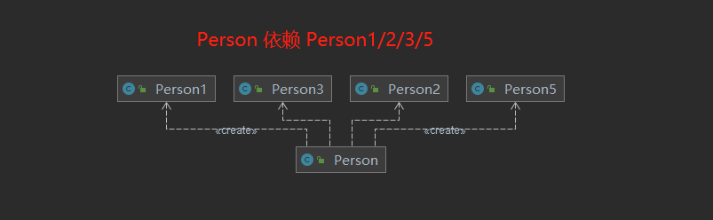
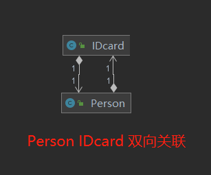
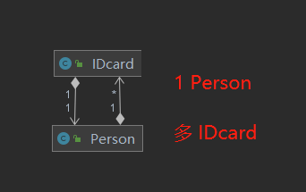

### 实现关系(Realization)

implements

```java
public interface User {
    void getUserName();
}

public class UserImpl implements User {
    @Override
    public void getUserName() {
        return;
    }
}
```
<!-- more -->

### 泛化关系(Generalization)

extends

```java
public class AdminUser extends UserImpl{

}
```


### 依赖关系（Dependency）

```java
public class Person {

    public void method1() {
        //A依赖于B的第一种表现形式：B为A的局部变量
        Person1 person1 = new Person1();
        person1.method1();
    }

    public void method2() {
        //A依赖于B的第二种表现形式： 调用B的静态方法
        Person2.method2();
    }

    public void method3(Person3 person3)  {
        //A依赖于B的第三种表现形式：B作为A的方法参数
        String s = person3.field1;
    }

    //A依赖于B的第四种表现形式：B作为A的方法的返回值
    public Person5 method4() {
        return new Person5();
    }
}


public class Person1{
    public void method1(){

    }
}
public class Person2 {
    public static void method2(){

    }
}
public class Person3 {
    public String field1;
}
public class Person5 {
}

```




### 关联关系(Association)

**单向关联**

```java
public class Person {
    private IDcard iDcard;
}

public class IDcard {
}
```


**双向关联**

```java
public class Person {
    private IDcard iDcard;
}

public class IDcard {
    private Person person;
}
```




也可以一对多

```java
public class Person {
    private List<IDcard> iDcard;
}

public class IDcard {
}

```




### 聚合关系 (Aggregation)

```java
public class Department {

    private List<Staff> staff;

    public List<Staff> getStaff() {
        return staff;
    }
    
}

public class Staff {
}

```


