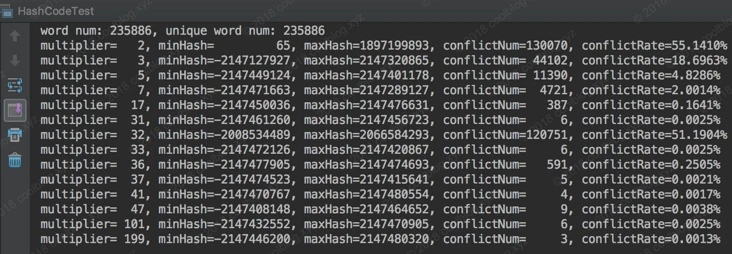
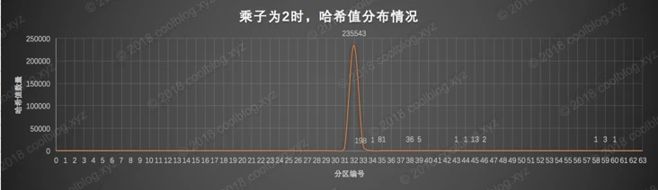
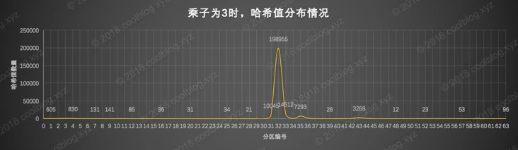
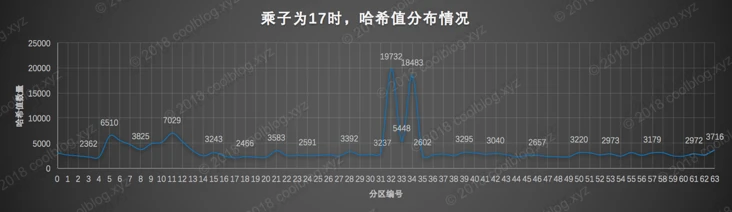
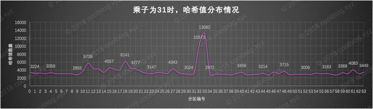
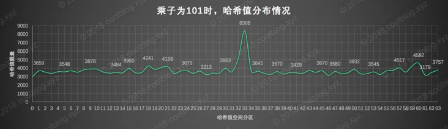

## 基本数据类型

Java 中有 8 种基本数据类型，分别为：

1. 6 种数字类型：
    - 4 种整数型：`byte`、`short`、`int`、`long`
    - 2 种浮点型：`float`、`double`
2. 1 种字符类型：`char`
3. 1 种布尔型：`boolean`。

这 8 种基本数据类型的默认值以及所占空间的大小如下：

| 基本类型 | 位数 | 字节 | 默认值 | 取值范围 |
| --- | --- | --- | --- | --- |
| `byte` | 8 | 1 | 0 | \-128 ~ 127 |
| `short` | 16 | 2 | 0 | \-32768 ~ 32767 |
| `int` | 32 | 4 | 0 | \-2147483648 ~ 2147483647 |
| `long` | 64 | 8 | 0L | \-9223372036854775808 ~ 9223372036854775807 |
| `char` | 16 | 2 | 'u0000' | 0 ~ 65535 |
| `float` | 32 | 4 | 0f | 1.4E-45 ~ 3.4028235E38 |
| `double` | 64 | 8 | 0d | 4.9E-324 ~ 1.7976931348623157E308 |
| `boolean` | 1 |  | false | true、false |

## == 和 equals() 的区别

**`==`** 对于基本类型和引用类型的作用效果是不同的：

- 对于基本数据类型来说，`==` 比较的是值。
- 对于引用数据类型来说，`==` 比较的是对象的内存地址。

> 因为 Java 只有值传递，所以，对于 == 来说，不管是比较基本数据类型，还是引用数据类型的变量，其本质比较的都是值，只是引用类型变量存的值是对象的地址。
**`equals()`** 不能用于判断基本数据类型的变量，只能用来判断两个对象是否相等。`equals()`方法存在于`Object`类中，而`Object`类是所有类的直接或间接父类，因此所有的类都有`equals()`方法。

`Object` 类 `equals()` 方法：

``` java
public boolean equals(Object obj) {
     return (this == obj);
}
```

`equals()` 方法存在两种使用情况：

- **类没有重写 `equals()`方法** ：通过`equals()`比较该类的两个对象时，等价于通过“==”比较这两个对象，使用的默认是 `Object`类`equals()`方法。
- **类重写了 `equals()`方法** ：一般我们都重写 `equals()`方法来比较两个对象中的属性是否相等；若它们的属性相等，则返回 true(即，认为这两个对象相等)。

举个例子（这里只是为了举例。实际上，你按照下面这种写法的话，像 IDEA 这种比较智能的 IDE 都会提示你将 `==` 换成 `equals()` ）：

``` java
String a = new String("ab"); // a 为一个引用
String b = new String("ab"); // b为另一个引用,对象的内容一样
String aa = "ab"; // 放在常量池中
String bb = "ab"; // 从常量池中查找
System.out.println(aa == bb);// true
System.out.println(a == b);// false
System.out.println(a.equals(b));// true
System.out.println(42 == 42.0);// true
```

`String` 中的 `equals` 方法是被重写过的，因为 `Object` 的 `equals` 方法是比较的对象的内存地址，而 `String` 的 `equals` 方法比较的是对象的值。

当创建 `String` 类型的对象时，虚拟机会在常量池中查找有没有已经存在的值和要创建的值相同的对象，如果有就把它赋给当前引用。如果没有就在常量池中重新创建一个 `String` 对象。

`String`类`equals()`方法：

``` java
public boolean equals(Object anObject) {
    if (this == anObject) {
        return true;
    }
    if (anObject instanceof String) {
        String anotherString = (String)anObject;
        int n = value.length;
        if (n == anotherString.value.length) {
            char v1[] = value;
            char v2[] = anotherString.value;
            int i = 0;
            while (n-- != 0) {
                if (v1[i] != v2[i])
                    return false;
                i++;
            }
            return true;
        }
    }
    return false;
}
```

## I/O

### 什么是序列化?什么是反序列化?

如果我们需要持久化 Java 对象比如将 Java 对象保存在文件中，或者在网络传输 Java 对象，这些场景都需要用到序列化。

简单来说：

- **序列化**： 将数据结构或对象转换成二进制字节流的过程
- **反序列化**：将在序列化过程中所生成的二进制字节流转换成数据结构或者对象的过程

对于 Java 这种面向对象编程语言来说，我们序列化的都是对象（Object）也就是实例化后的类(Class)，但是在 C++这种半面向对象的语言中，struct(结构体)定义的是数据结构类型，而 class 对应的是对象类型。

维基百科是如是介绍序列化的：

> **序列化**（serialization）在计算机科学的数据处理中，是指将数据结构或对象状态转换成可取用格式（例如存成文件，存于缓冲，或经由网络中发送），以留待后续在相同或另一台计算机环境中，能恢复原先状态的过程。依照序列化格式重新获取字节的结果时，可以利用它来产生与原始对象相同语义的副本。对于许多对象，像是使用大量引用的复杂对象，这种序列化重建的过程并不容易。面向对象中的对象序列化，并不概括之前原始对象所关系的函数。这种过程也称为对象编组（marshalling）。从一系列字节提取数据结构的反向操作，是反序列化（也称为解编组、deserialization、unmarshalling）。
综上：**序列化的主要目的是通过网络传输对象或者说是将对象存储到文件系统、数据库、内存中。**


### Java 序列化中如果有些字段不想进行序列化，怎么办？

对于不想进行序列化的变量，使用 `transient` 关键字修饰。

`transient` 关键字的作用是：阻止实例中那些用此关键字修饰的的变量序列化；当对象被反序列化时，被 `transient` 修饰的变量值不会被持久化和恢复。

关于 `transient` 还有几点注意：

- `transient` 只能修饰变量，不能修饰类和方法。
- `transient` 修饰的变量，在反序列化后变量值将会被置成类型的默认值。例如，如果是修饰 `int` 类型，那么反序列后结果就是 `0`。
- `static` 变量因为不属于任何对象(Object)，所以无论有没有 `transient` 关键字修饰，均不会被序列化。


## 面向对象三要素：封装、继承、多态

- `封装`：封装的意义，在于明确标识出允许外部使用的所有成员函数和数据项，或者叫接口。
- `继承`：
   - 继承基类的方法，并做出自己的扩展；
   - 声明某个子类兼容于某基类（或者说，接口上完全兼容于基类），外部调用者可无需关注其差别（内部机制会自动把请求派发`dispatch`到合适的逻辑）。
- `多态`：基于对象所属类的不同，外部对同一个方法的调用，实际执行的逻辑不同。**很显然，多态实际上是依附于继承的第二种含义的**。

### 多态 

方法签名：`方法名 + 参数列表(参数类型、个数、顺序)`

#### 重写 

子类重写父类方法，**只有实例方法可以被重写**，重写后的方法必须仍为实例方法。**成员变量和静态方法都不能被重写，只能被隐藏**。

重写实例方法：超类Parent中有实例方法A，子类child定义了与A **相同签名和子集返回类型** 的实例方法B，子类对象ChildObj只能调用自己的实例方法B。

> 方法的重写（override）两同两小一大原则：
> 1. 方法名相同，参数类型相同
> 2. 子类返回类型小于等于父类方法返回类型
> 3. 子类抛出异常小于等于父类方法抛出异常
> 4. 子类访问权限大于等于父类方法访问权限

注意：

- 不能重写static静态方法。(形式上可以写，但本质上不是重写，属于下面要讲的隐藏)

- 重写方法可以改变其它的方法修饰符，如`final`,`synchronized`,`native`。不管被重写方法中有无final修饰的参数，重写方法都可以增加、保留、去掉这个参数的 final 修饰符(**参数修饰符不属于方法签名**)。


#### 重载 

在同一个类中，有多个方法名相同，参数列表不同（参数个数不同，参数类型不同），与方法的返回值无关，与权限修饰符无关。**编译器通过对方法签名的识别即可静态编译出不同的方法。这也是java中重载与重写的区别之一**。

> 重载只是一种语言特性，与多态无关，与面向对象也无关。**多态是为了实现接口重用**。

Java中方法是可以和类名同名的，和构造方法唯一的区别就是，**构造方法没有返回值**。

#### 隐藏 

隐藏与覆盖在形式上极其类似(语法规则)，但有着本质的区别：只有成员变量(不管是不是静态)和静态方法可以被隐藏。

##### 成员变量 

超类 Parent 中有成员变量 A ，子类 Child 定义了与 A 同名的成员变量 B ，子类对象 ChildObj 调用的是自己的成员变量 B。如果把子类对象 ChildObj 转换为超类对象 ParentObj ，ParentObj 调用的是超类的成员变量 A ！

1. 隐藏成员变量时，只要同名即可，可以更改变量类型(无论基本类型还是隐藏类型)

2. 不能隐藏超类中的 private 成员变量，换句话说，只能隐藏可以访问的成员变量。

3. 隐藏超类成员变量 A 时，可以降低或提高子类成员变量B的访问权限，只要A不是 private。

4. 隐藏成员变量与是否静态无关！静态变量可以隐藏实例变量，实例变量也可以隐藏静态变量。

5. 可以隐藏超类中的final成员变量。


##### 静态方法 

超类 Parent 有静态方法 A ，子类 Child 定义了与 A _相同签名和子集返回类型_ 的静态方法 B ，子类对象 ChildObj 调用的是自己的静态方法 B 。如果把子类对象 ChildObj 转换为超类对象 ParentObj ，ParentObj 调用的是超类的静态方法 A ！

> 隐藏后的方法必须仍为静态方法


## 为什么 String hashCode 方法选择数字31作为乘子
### 1\. 背景

某天，我在写代码的时候，无意中点开了 String hashCode 方法。然后大致看了一下 hashCode 的实现，发现并不是很复杂。但是我从源码中发现了一个奇怪的数字，也就是本文的主角31。这个数字居然不是用常量声明的，所以没法从字面意思上推断这个数字的用途。后来带着疑问和好奇心，到网上去找资料查询一下。在看完资料后，默默的感叹了一句，原来是这样啊。那么到底是哪样呢？在接下来章节里，请大家带着好奇心和我揭开数字31的用途之谜。

### 2\. 选择数字31的原因

在详细说明 String hashCode 方法选择数字31的作为乘子的原因之前，我们先来看看 String hashCode 方法是怎样实现的，如下：

``` java
public int hashCode() {
int h = hash;
if (h == 0 && value.length > 0) {
char val[] = value;

        for (int i = 0; i < value.length; i++) {
            h = 31 * h + val[i];
        }
        hash = h;
    }
    return h;
}
```


上面的代码就是 String hashCode 方法的实现，是不是很简单。实际上 hashCode 方法核心的计算逻辑只有三行，也就是代码中的 for 循环。我们可以由上面的 for 循环推导出一个计算公式，hashCode 方法注释中已经给出。如下：

> s[0]*31^(n-1) + s[1]*31^(n-2) + ... + s[n-1]

这里说明一下，上面的 s 数组即源码中的 val 数组，是 String 内部维护的一个 char 类型数组。这里我来简单推导一下这个公式：
``` 
假设 n=3
i=0 -> h = 31 * 0 + val[0]
i=1 -> h = 31 * (31 * 0 + val[0]) + val[1]
i=2 -> h = 31 * (31 * (31 * 0 + val[0]) + val[1]) + val[2]
h = 31*31*31*0 + 31*31*val[0] + 31*val[1] + val[2]
h = 31^(n-1)*val[0] + 31^(n-2)*val[1] + val[2]
```

上面的公式包括公式的推导并不是本文的重点，大家了解了解即可。接下来来说说本文的重点，即选择31的理由。从网上的资料来看，一般有如下两个原因：

第一，31是一个不大不小的质数，是作为 hashCode 乘子的优选质数之一。另外一些相近的质数，比如37、41、43等等，也都是不错的选择。那么为啥偏偏选中了31呢？请看第二个原因。

第二、31可以被 JVM 优化，`31 * i = (i << 5) - i`。

上面两个原因中，第一个需要解释一下，第二个比较简单，就不说了。下面我来解释第一个理由。一般在设计哈希算法时，会选择一个特殊的质数。至于为啥选择质数，我想应该是可以降低哈希算法的冲突率。至于原因，这个就要问数学家了，我几乎可以忽略的数学水平解释不了这个原因。上面说到，31是一个不大不小的质数，是优选乘子。那为啥同是质数的2和101（或者更大的质数）就不是优选乘子呢，分析如下。

这里先分析质数2。首先，假设 `n = 6`，然后把质数2和 n 带入上面的计算公式。并仅计算公式中次数最高的那一项，结果是`2^5 = 32`，是不是很小。所以这里可以断定，当字符串长度不是很长时，用质数2做为乘子算出的哈希值，数值不会很大。也就是说，哈希值会分布在一个较小的数值区间内，分布性不佳，最终可能会导致冲突率上升。

上面说了，质数2做为乘子会导致哈希值分布在一个较小区间内，那么如果用一个较大的大质数101会产生什么样的结果呢？根据上面的分析，我想大家应该可以猜出结果了。就是不用再担心哈希值会分布在一个小的区间内了，因为`101^5 = 10,510,100,501`。但是要注意的是，这个计算结果太大了。如果用 int 类型表示哈希值，结果会溢出，最终导致数值信息丢失。尽管数值信息丢失并不一定会导致冲突率上升，但是我们暂且先认为质数101（或者更大的质数）也不是很好的选择。最后，我们再来看看质数31的计算结果： `31^5 = 28629151`，结果值相对于`32`和`10,510,100,501`来说。是不是很nice，不大不小。

上面用了比较简陋的数学手段证明了数字31是一个不大不小的质数，是作为 hashCode 乘子的优选质数之一。接下来我会用详细的实验来验证上面的结论，不过在验证前，我们先看看 Stack Overflow 上关于这个问题的讨论，[Why does Java's hashCode() in String use 31 as a multiplier?](https://link.segmentfault.com/?enc=LtrhZOldy60ElUc5ATnWGg%3D%3D.a%2FzrgzLmQnzFf2NNL7Tc9RiGVFJjPRhZKNqFfTY5rszNH3BD24TlsVjVQ1%2FqNOI6%2FNKx0DJQ89vUXRZktZZR0J4Bae84DjUdbCkI%2Fa1oULdJZ2a9BQv%2FQI6uirI57sgiLoWG7qjtJtr%2FvHZBkw2i5w%3D%3D)。其中排名第一的答案引用了《Effective Java》中的一段话，这里也引用一下：

> The value 31 was chosen because it is an odd prime. If it were even and the multiplication overflowed, information would be lost, as multiplication by 2 is equivalent to shifting. The advantage of using a prime is less clear, but it is traditional. A nice property of 31 is that the multiplication can be replaced by a shift and a subtraction for better performance: `31 * i == (i << 5) - i`\`. Modern VMs do this sort of optimization automatically.

简单翻译一下：

> 选择数字31是因为它是一个奇质数，如果选择一个偶数会在乘法运算中产生溢出，导致数值信息丢失，因为乘二相当于移位运算。选择质数的优势并不是特别的明显，但这是一个传统。同时，数字31有一个很好的特性，即乘法运算可以被移位和减法运算取代，来获取更好的性能：`31 * i == (i << 5) - i`，现代的 Java 虚拟机可以自动的完成这个优化。

排名第二的答案设这样说的：

> As Goodrich and Tamassia point out, If you take over 50,000 English words (formed as the union of the word lists provided in two variants of Unix), using the constants 31, 33, 37, 39, and 41 will produce less than 7 collisions in each case. Knowing this, it should come as no surprise that many Java implementations choose one of these constants.

这段话也翻译一下：

> 正如 Goodrich 和 Tamassia 指出的那样，如果你对超过 50,000 个英文单词（由两个不同版本的 Unix 字典合并而成）进行 hash code 运算，并使用常数 31, 33, 37, 39 和 41 作为乘子，每个常数算出的哈希值冲突数都小于7个，所以在上面几个常数中，常数 31 被 Java 实现所选用也就不足为奇了。

上面的两个答案完美的解释了 Java 源码中选用数字 31 的原因。接下来，我将针对第二个答案就行验证，请大家继续往下看。

### 3\. 实验及数据可视化

本节，我将使用不同的数字作为乘子，对超过23万个英文单词进行哈希运算，并计算哈希算法的冲突率。同时，我也将针对不同乘子算出的哈希值分布情况进行可视化处理，让大家可以直观的看到数据分布情况。本次实验所使用的数据是 Unix/Linux 平台中的英文字典文件，文件路径为 `/usr/share/dict/words`。

#### 3.1 哈希值冲突率计算

计算哈希算法冲突率并不难，比如可以一次性将所有单词的 hash code 算出，并放入 Set 中去除重复值。之后拿单词数减去 set.size() 即可得出冲突数，有了冲突数，冲突率就可以算出来了。当然，如果使用 JDK8 提供的流式计算 API，则可更方便算出，代码片段如下：

``` java
public static Integer hashCode(String str, Integer multiplier) {
int hash = 0;
for (int i = 0; i < str.length(); i++) {
hash = multiplier * hash + str.charAt(i);
}

    return hash;
}

/**
* 计算 hash code 冲突率，顺便分析一下 hash code 最大值和最小值，并输出
* @param multiplier
* @param hashs
*/
public static void calculateConflictRate(Integer multiplier, List<Integer> hashs) {
Comparator<Integer> cp = (x, y) -> x > y ? 1 : (x < y ? -1 : 0);
int maxHash = hashs.stream().max(cp).get();
int minHash = hashs.stream().min(cp).get();

    // 计算冲突数及冲突率
    int uniqueHashNum = (int) hashs.stream().distinct().count();
    int conflictNum = hashs.size() - uniqueHashNum;
    double conflictRate = (conflictNum * 1.0) / hashs.size();

    System.out.println(String.format("multiplier=%4d, minHash=%11d, maxHash=%10d, conflictNum=%6d, conflictRate=%.4f%%",
                multiplier, minHash, maxHash, conflictNum, conflictRate * 100));
}
```

结果如下：



从上图可以看出，使用较小的质数做为乘子时，冲突率会很高。尤其是质数2，冲突率达到了 55.14%。同时我们注意观察质数2作为乘子时，哈希值的分布情况。可以看得出来，哈希值分布并不是很广，仅仅分布在了整个哈希空间的正半轴部分，即 0 ~ 2<sup>31</sup>\-1。而负半轴 -2<sup>31</sup> ~ -1，则无分布。这也证明了我们上面断言，即质数2作为乘子时，对于短字符串，生成的哈希值分布性不佳。然后再来看看我们之前所说的 31、37、41 这三个不大不小的质数，表现都不错，冲突数都低于7个。而质数 101 和 199 表现的也很不错，冲突率很低，这也说明哈希值溢出并不一定会导致冲突率上升。但是这两个家伙一言不合就溢出，我们认为他们不是哈希算法的优选乘子。最后我们再来看看 32 和 36 这两个偶数的表现，结果并不好，尤其是 32，冲突率超过了了50%。尽管 36 表现的要好一点，不过和 31，37相比，冲突率还是比较高的。当然并非所有的偶数作为乘子时，冲突率都会比较高，大家有兴趣可以自己验证。

#### 3.2 哈希值分布可视化

上一节分析了不同数字作为乘子时的冲突率情况，这一节来分析一下不同数字作为乘子时，哈希值的分布情况。在详细分析之前，我先说说哈希值可视化的过程。我原本是打算将所有的哈希值用一维散点图进行可视化，但是后来找了一圈，也没找到合适的画图工具。加之后来想了想，一维散点图可能不合适做哈希值可视化，因为这里有超过23万个哈希值。也就意味着会在图上显示超过23万个散点，如果不出意外的话，这23万个散点会聚集的很密，有可能会变成一个大黑块，就失去了可视化的意义了。所以这里选择了另一种可视化效果更好的图表，也就是 excel 中的平滑曲线的二维散点图（下面简称散点曲线图）。当然这里同样没有把23万散点都显示在图表上，太多了。所以在实际绘图过程中，我将哈希空间等分成了64个子区间，并统计每个区间内的哈希值数量。最后将分区编号做为X轴，哈希值数量为Y轴，就绘制出了我想要的二维散点曲线图了。这里举个例子说明一下吧，以第0分区为例。第0分区数值区间是\[-2147483648, -2080374784)，我们统计落在该数值区间内哈希值的数量，得到 `<分区编号, 哈希值数量>` 数值对，这样就可以绘图了。分区代码如下：

``` java
/**
* 将整个哈希空间等分成64份，统计每个空间内的哈希值数量
* @param hashs
*/
public static Map<Integer, Integer> partition(List<Integer> hashs) {
// step = 2^32 / 64 = 2^26
final int step = 67108864;
List<Integer> nums = new ArrayList<>();
Map<Integer, Integer> statistics = new LinkedHashMap<>();
int start = 0;
for (long i = Integer.MIN_VALUE; i <= Integer.MAX_VALUE; i += step) {
final long min = i;
final long max = min + step;
int num = (int) hashs.parallelStream()
.filter(x -> x >= min && x < max).count();

        statistics.put(start++, num);
        nums.add(num);
    }

    // 为了防止计算出错，这里验证一下
    int hashNum = nums.stream().reduce((x, y) -> x + y).get();
    assert hashNum == hashs.size();

    return statistics;
}
```

本文中的哈希值是用整形表示的，整形的数值区间是 `[-2147483648, 2147483647]`，区间大小为 `2^32`。所以这里可以将区间等分成64个子区间，每个自子区间大小为 `2^26`。详细的分区对照表如下：

| 分区编号 | 分区下限 | 分区上限 | 分区编号 | 分区下限 | 分区上限 |
| --- | --- | --- | --- | --- | --- |
| 0 | \-2147483648 | \-2080374784 | 32 | 0 | 67108864 |
| 1 | \-2080374784 | \-2013265920 | 33 | 67108864 | 134217728 |
| 2 | \-2013265920 | \-1946157056 | 34 | 134217728 | 201326592 |
| 3 | \-1946157056 | \-1879048192 | 35 | 201326592 | 268435456 |
| 4 | \-1879048192 | \-1811939328 | 36 | 268435456 | 335544320 |
| 5 | \-1811939328 | \-1744830464 | 37 | 335544320 | 402653184 |
| 6 | \-1744830464 | \-1677721600 | 38 | 402653184 | 469762048 |
| 7 | \-1677721600 | \-1610612736 | 39 | 469762048 | 536870912 |
| 8 | \-1610612736 | \-1543503872 | 40 | 536870912 | 603979776 |
| 9 | \-1543503872 | \-1476395008 | 41 | 603979776 | 671088640 |
| 10 | \-1476395008 | \-1409286144 | 42 | 671088640 | 738197504 |
| 11 | \-1409286144 | \-1342177280 | 43 | 738197504 | 805306368 |
| 12 | \-1342177280 | \-1275068416 | 44 | 805306368 | 872415232 |
| 13 | \-1275068416 | \-1207959552 | 45 | 872415232 | 939524096 |
| 14 | \-1207959552 | \-1140850688 | 46 | 939524096 | 1006632960 |
| 15 | \-1140850688 | \-1073741824 | 47 | 1006632960 | 1073741824 |
| 16 | \-1073741824 | \-1006632960 | 48 | 1073741824 | 1140850688 |
| 17 | \-1006632960 | \-939524096 | 49 | 1140850688 | 1207959552 |
| 18 | \-939524096 | \-872415232 | 50 | 1207959552 | 1275068416 |
| 19 | \-872415232 | \-805306368 | 51 | 1275068416 | 1342177280 |
| 20 | \-805306368 | \-738197504 | 52 | 1342177280 | 1409286144 |
| 21 | \-738197504 | \-671088640 | 53 | 1409286144 | 1476395008 |
| 22 | \-671088640 | \-603979776 | 54 | 1476395008 | 1543503872 |
| 23 | \-603979776 | \-536870912 | 55 | 1543503872 | 1610612736 |
| 24 | \-536870912 | \-469762048 | 56 | 1610612736 | 1677721600 |
| 25 | \-469762048 | \-402653184 | 57 | 1677721600 | 1744830464 |
| 26 | \-402653184 | \-335544320 | 58 | 1744830464 | 1811939328 |
| 27 | \-335544320 | \-268435456 | 59 | 1811939328 | 1879048192 |
| 28 | \-268435456 | \-201326592 | 60 | 1879048192 | 1946157056 |
| 29 | \-201326592 | \-134217728 | 61 | 1946157056 | 2013265920 |
| 30 | \-134217728 | \-67108864 | 62 | 2013265920 | 2080374784 |
| 31 | \-67108864 | 0 | 63 | 2080374784 | 2147483648 |

接下来，让我们对照上面的分区表，对数字2、3、17、31、101的散点曲线图进行简单的分析。先从数字2开始，数字2对于的散点曲线图如下：



上面的图还是很一幕了然的，乘子2算出的哈希值几乎全部落在第32分区，也就是 `[0, 67108864)`数值区间内，落在其他区间内的哈希值数量几乎可以忽略不计。这也就不难解释为什么数字2作为乘子时，算出哈希值的冲突率如此之高的原因了。所以这样的哈希算法要它有何用啊，拖出去斩了吧。接下来看看数字3作为乘子时的表现：



3作为乘子时，算出的哈希值分布情况和2很像，只不过稍微好了那么一点点。从图中可以看出绝大部分的哈希值最终都落在了第32分区里，哈希值的分布性很差。这个也没啥用，拖出去枪毙5分钟吧。在看看数字17的情况怎么样：



数字17作为乘子时的表现，明显比上面两个数字好点了。虽然哈希值在第32分区和第34分区有一定的聚集，但是相比较上面2和3，情况明显好好了很多。除此之外，17作为乘子算出的哈希值在其他区也均有分布，且较为均匀，还算是一个不错的乘子吧。



接下来来看看我们本文的主角31了，31作为乘子算出的哈希值在第33分区有一定的小聚集。不过相比于数字17，主角31的表现又好了一些。首先是哈希值的聚集程度没有17那么严重，其次哈希值在其他区分布的情况也要好于17。总之，选31，准没错啊。

  
最后再来看看大质数101的表现，不难看出，质数101作为乘子时，算出的哈希值分布情况要好于主角31，有点喧宾夺主的意思。不过不可否认的是，质数101的作为乘子时，哈希值的分布性确实更加均匀。所以如果不在意质数101容易导致数据信息丢失问题，或许其是一个更好的选择。

## 出处
[Java Guide](https://javaguide.cn/java/basis/java-basic-questions-01.html#%E5%9F%BA%E6%9C%AC%E6%95%B0%E6%8D%AE%E7%B1%BB%E5%9E%8B)

[https://hadyang.com/interview/docs/java/oop/](https://hadyang.com/interview/docs/java/oop/)

[https://segmentfault.com/a/1190000010799123](https://segmentfault.com/a/1190000010799123)