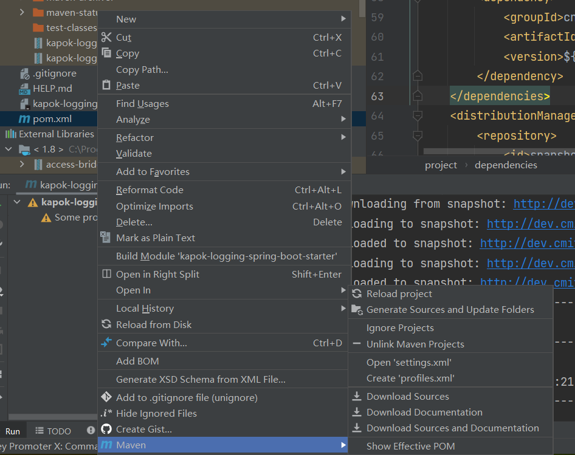
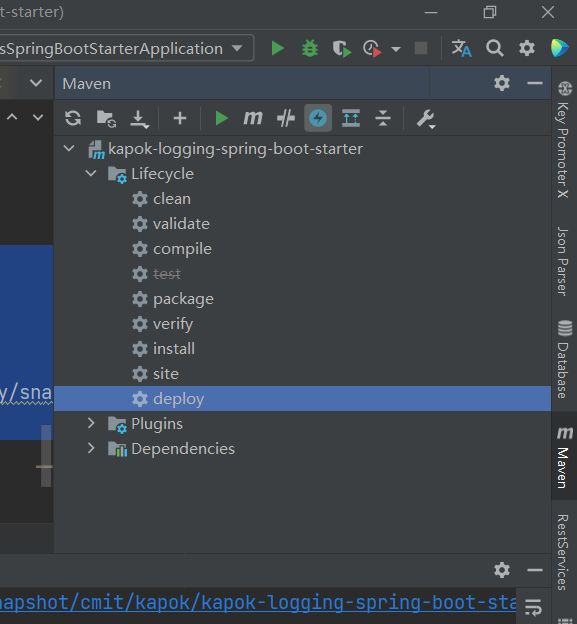

## 前言

在开发springboot starter的时候发现，如果写完的starter直接导入已有工程有些问题，还是要上传到maven然后通过maven引入比较规范，但是每次通过网页管理上传maven包太过麻烦，所以配置了一下通过idea直接deploy上私有仓库，下面记录一下过程。
<!-- more -->

## 新建Maven库

* 1、以管理员身份登录maven私服

* 2、Repository --> Repositories --> create Repositories 
 选择maven2(hosted) --> Version policy 根据需要选择Release 或 Snapshot


## IDEA配置maven settings

* 1、 右键pom --> Maven --> open 'settings.xml'

  

* 2、配置nexus的账号密码
    ```xml
    <?xml version="1.0" encoding="UTF-8"?>
    <settings xmlns="http://maven.apache.org/SETTINGS/1.0.0"
              xmlns:xsi="http://www.w3.org/2001/XMLSchema-instance"
              xsi:schemaLocation="http://maven.apache.org/SETTINGS/1.0.0 http://maven.apache.org/xsd/settings-1.0.0.xsd">
        <servers>
            <server>
                <id>snapshot</id>
                <username>admin</username>
                <password>devnexus@1234</password>
            </server>
        </servers>
    </settings>
    ```

## 配置starter项目

* 1、pom中添加一下代码：

    ```xml
    <distributionManagement>
        <repository>
            <id>snapshot</id>
            <name>snapshot</name>
            <url>http://dev.cmitgf.com:28081/repository/snapshot/</url>
        </repository>
    </distributionManagement>
    ```

## 部署


maven deploy即可。

**如果你只需要安装在本地maven，只需要maven install**

