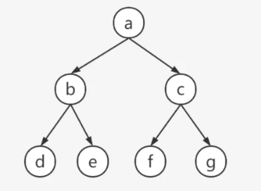

``` java
class TreeNode{
    public String val;
    public TreeNode left;
    public TreeNode right;

    public TreeNode(String val) {
        this.val = val;
    }

    public TreeNode(String val, TreeNode left, TreeNode right) {
        this.val = val;
        this.left = left;
        this.right = right;
    }
}
```

<!-- more -->

## 先序遍历


上图中序遍历顺序：abdecfg

代码：

``` java
 public static void preOrder(TreeNode root){
       if (root == null){
           return;
       }
       System.out.println(root.val);
       preOrder(root.left);
       preOrder(root.right);
}
```


## 中序遍历

上图中序遍历顺序：dbeafcg

代码：

``` java
public static void inOrder(TreeNode root){
       if (root == null){
           return;
       }
       inOrder(root.left);
       System.out.println(root.val);
       inOrder(root.right)
       
}
```


## 后序遍历

上图后序遍历顺序：debfgca

代码：

```java
public static void postOrder(TreeNode root){
       if (root == null){
           return;
       }
       postOrder(root.left);
       postOrder(root.right);
       System.out.println(root.val);
}
```

