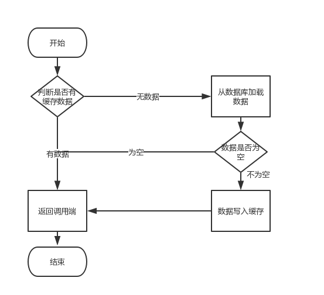

# 分布式缓存

高并发环境下，例如典型的淘宝双11秒杀，几分钟内上亿的用户涌入淘宝，这个时候如果访问不加拦截，让大量的读写请求涌向数据库，由于磁盘的处理速度与内存显然不在一个量级，服务器马上就要宕机。**从减轻数据库的压力和提高系统响应速度两个角度来考虑，都会在数据库之前加一层缓存**，访问压力越大的，在缓存之前就开始 CDN 拦截图片等访问请求。

并且由于最早的单台机器的内存资源以及承载能力有限，如果大量使用本地缓存，也会使相同的数据被不同的节点存储多份，对内存资源造成较大的浪费，因此，才催生出了分布式缓存。

## 应用场景

  1. **页面缓存**：用来缓存Web 页面的内容片段,包括HTML、CSS 和图片等;
  1. **应用对象缓存**：缓存系统作为ORM 框架的二级缓存对外提供服务,目的是减轻数据库的负载压力,加速应用访问;解决分布式Web部署的 session 同步问题，状态缓存.缓存包括Session 会话状态及应用横向扩展时的状态数据等,这类数据一般是难以恢复的,对可用性要求较高,多应用于高可用集群。
  1. **并行处理**：通常涉及大量中间计算结果需要共享;
  1. **云计算领域提供分布式缓存服务**

## 常见问题和挑战

### 缓存雪崩

缓存雪崩我们可以简单的理解为：由于原有缓存失效、新缓存未到之间(**例如：我们设置缓存时采用了相同的过期时间，在同一时刻出现大面积的缓存过期**)，所有原本应该访问缓存的请求都去查询数据库了，而对数据库CPU和内存造成巨大压力，严重的会造成数据库宕机。从而形成一系列连锁反应，造成整个系统崩溃。

### 缓存穿透

缓存穿透是指用户查询数据，在数据库没有，自然在缓存中也不会有。**这样就导致用户查询的时候，在缓存中找不到，每次都要去数据库再查询一遍，然后返回空**（*相当于进行了两次无用的查询*）。这样请求就绕过缓存直接查数据库，这也是经常提的缓存命中率问题。

### 缓存预热

缓存预热这个应该是一个比较常见的概念，相信很多小伙伴都应该可以很容易的理解，缓存预热就是系统上线后，将相关的缓存数据直接加载到缓存系统。这样就可以避免在用户请求的时候，先查询数据库，然后再将数据缓存的问题！用户直接查询事先被预热的缓存数据！

### 缓存更新

除了缓存服务器自带的缓存失效策略之外，我们还可以根据具体的业务需求进行自定义的缓存淘汰，常见的策略有两种：

  1. 定时去清理过期的缓存；
  2. 当有用户请求过来时，再判断这个请求所用到的缓存是否过期，过期的话就去底层系统得到新数据并更新缓存。

两者各有优劣，第一种的缺点是维护大量缓存的key是比较麻烦的，第二种的缺点就是每次用户请求过来都要判断缓存失效，逻辑相对比较复杂！具体用哪种方案，大家可以根据自己的应用场景来权衡。

### 缓存降级

当访问量剧增、服务出现问题（如响应时间慢或不响应）或非核心服务影响到核心流程的性能时，仍然需要保证服务还是可用的，即使是有损服务。系统可以根据一些关键数据进行自动降级，也可以配置开关实现人工降级。

降级的最终目的是 **保证核心服务可用，即使是有损的**。而且有些服务是无法降级的（如加入购物车、结算）。

在进行降级之前要对系统进行梳理，看看系统是不是可以丢卒保帅；从而梳理出哪些必须誓死保护，哪些可降级；比如可以参考日志级别设置预案：

  1. **一般**：比如有些服务偶尔因为网络抖动或者服务正在上线而超时，可以自动降级；
  2. **警告**：有些服务在一段时间内成功率有波动（如在95~100%之间），可以自动降级或人工降级，并发送告警；
  3. **错误**：比如可用率低于90%，或者数据库连接池被打爆了，或者访问量突然猛增到系统能承受的最大阀值，此时可以根据情况自动降级或者人工降级；
  4. **严重错误**：比如因为特殊原因数据错误了，此时需要紧急人工降级。

### 缓存与数据库不一致问题

首先，缓存由于其高并发和高性能的特性，已经在项目中被广泛使用。在读取缓存方面，大家没啥疑问，都是按照下图的流程来进行业务操作。

但是在更新缓存方面，对于更新完数据库，是更新缓存呢，还是删除缓存。又或者是先删除缓存，再更新数据库，其实大家存在很大的争议。

从理论上来说，给 **缓存设置过期时间，是保证最终一致性的解决方案**。这种方案下，我们可以对存入缓存的数据设置过期时间，所有的写操作以数据库为准，对缓存操作只是尽最大努力即可。也就是说如果数据库写成功，缓存更新失败，那么只要到达过期时间，则后面的读请求自然会从数据库中读取新值然后回填缓存。

#### 先删除缓存，再更新数据库

该方案会导致不一致的原因是。同时有一个请求A进行更新操作，另一个请求B进行查询操作。那么会出现如下情形:

  1. 请求A进行写操作，删除缓存
  1. 请求B查询发现缓存不存在
  1. 请求B去数据库查询得到旧值
  1. 请求B将旧值写入缓存
  1. 请求A将新值写入数据库

上述情况就会导致不一致的情形出现。而且，如果不采用给缓存设置过期时间策略，该数据永远都是脏数据。

可以通过：

  1. 更新操作数据库后，再次更新缓存来实现
  2. 缓存设置过期时间，等待过期时间后，数据恢复
